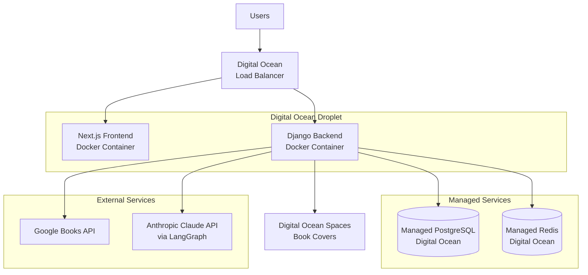
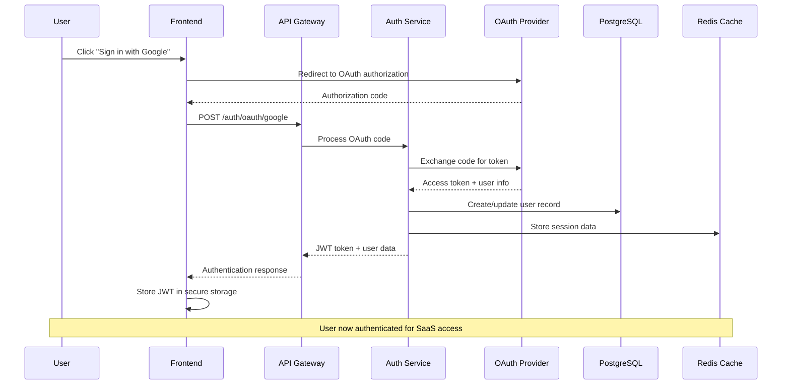
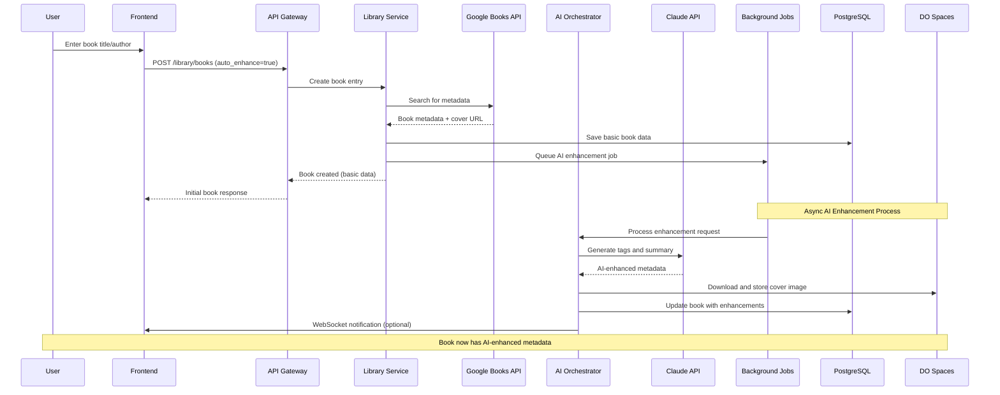
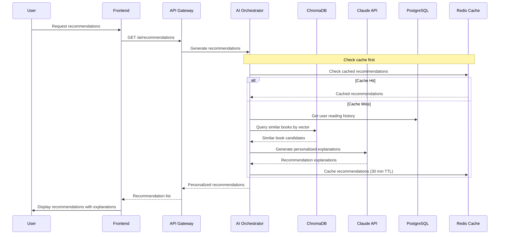
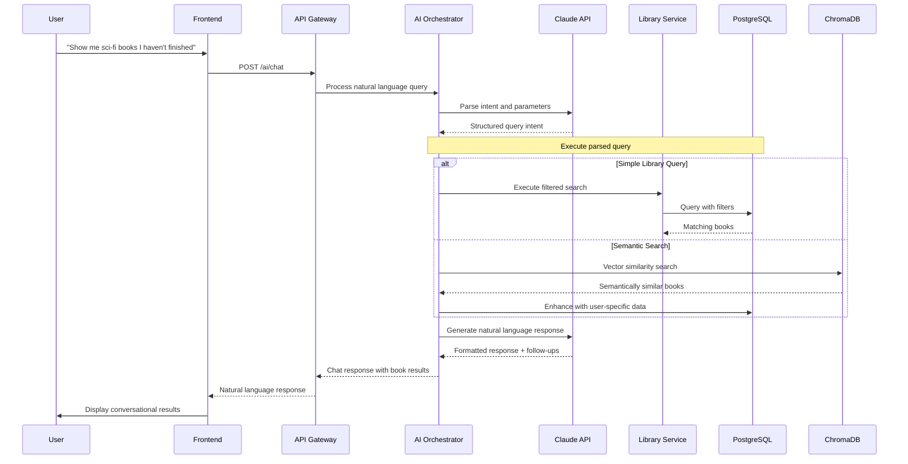
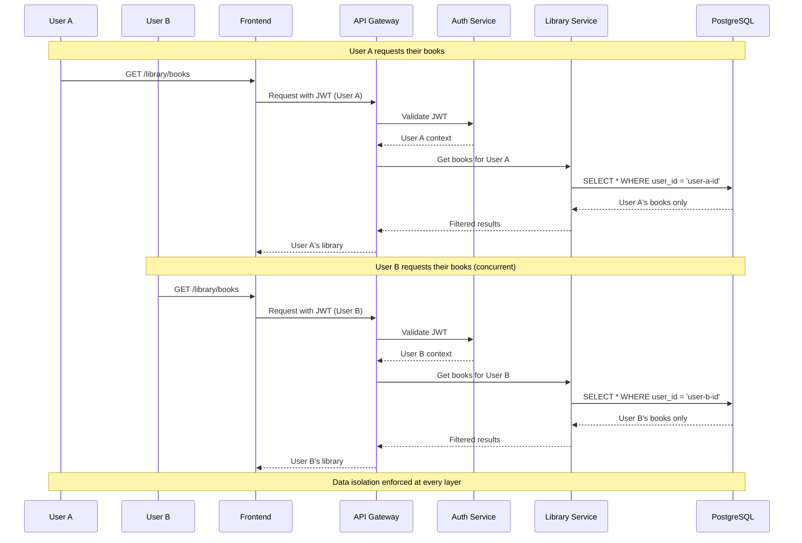
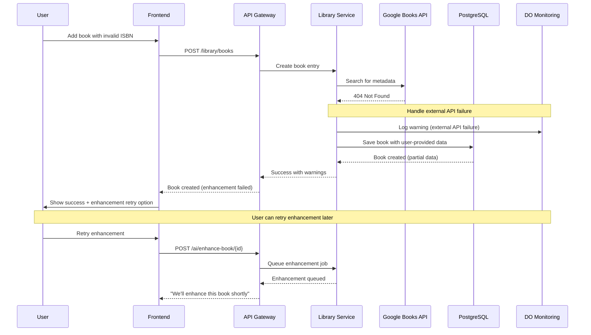
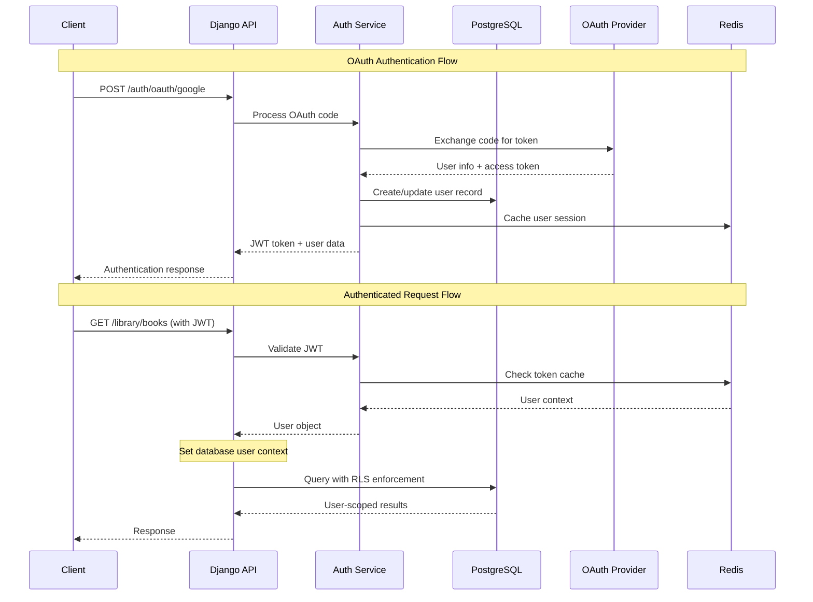
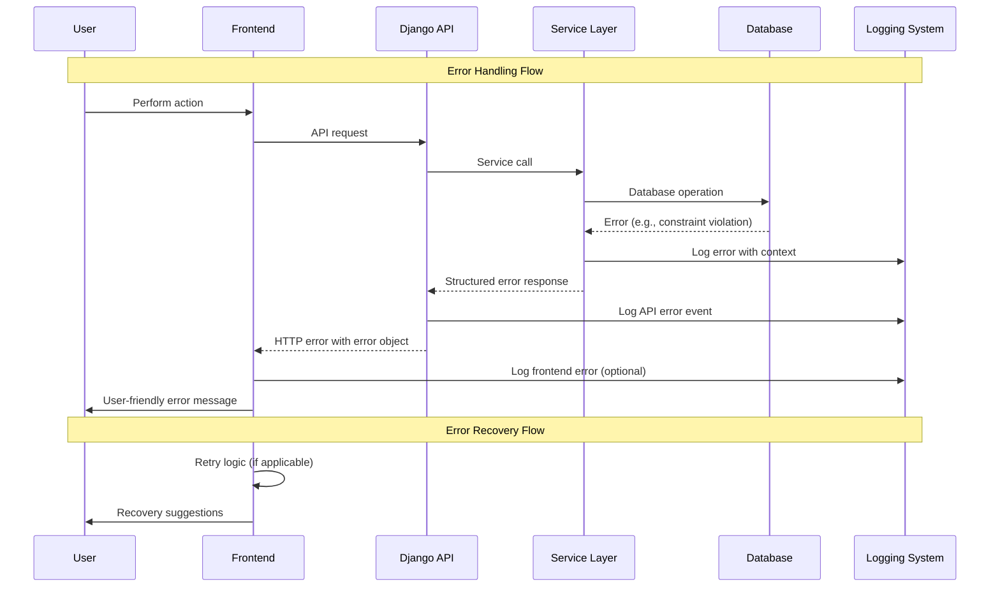

# Minerva Fullstack Architecture Document

**Session Date:** 2025-01-19
**Facilitator:** Architect Winston
**Participant:** Kevin Woodfield

## Introduction

This document outlines the complete fullstack architecture for **Minerva**, including backend systems, frontend implementation, and their integration. It serves as the single source of truth for AI-driven development, ensuring consistency across the entire technology stack.

This unified approach combines what would traditionally be separate backend and frontend architecture documents, streamlining the development process for modern fullstack applications where these concerns are increasingly intertwined.

### Starter Template Analysis

Based on your existing documentation, this is **not** a greenfield project using starter templates. You have an **existing Django + Next.js application** that you're transforming into a SaaS platform with:
- Existing Django 4.2.21 backend with Django Ninja
- Existing Next.js 14.1.0 frontend with Chakra UI  
- Planned Docker containerization
- Planned AI integration with LangGraph
- Planned SaaS transformation with multi-user authentication

### Change Log

| Date | Version | Description | Author |
|------|---------|-------------|---------|
| 2025-01-19 | 1.0 | Initial comprehensive architecture document | Winston (Architect) |

## High Level Architecture

### Technical Summary

Minerva employs a modern fullstack architecture with Django REST APIs serving a Next.js React frontend, deployed via Docker containers for consistent development and production environments. The backend leverages Django Ninja for type-safe APIs with PostgreSQL for data persistence, while the frontend uses Chakra UI for consistent design and TypeScript for type safety. Key integration points include RESTful APIs for data exchange, JWT authentication (planned), and Redis for caching and session management. The infrastructure supports Docker-based deployment with planned AI agent integration via LangGraph workflows, enabling the transformation from a personal book management tool to a multi-tenant SaaS platform.

### Platform and Infrastructure Choice

**Platform:** Digital Ocean  
**Key Services:** Droplets (VMs), Managed PostgreSQL, Managed Redis, Load Balancers, Spaces (object storage), Container Registry  
**Deployment Host and Regions:** Existing droplet region + managed services in same region

### Repository Structure

**Structure:** Monorepo (existing structure maintained)
**Monorepo Tool:** npm workspaces (current setup)
**Package Organization:** Root workspace with backend/ and frontend/ packages, shared utilities in root

### High Level Architecture Diagram



### Architectural Patterns

- **Container-First Architecture:** Docker containers for consistent deployment across environments - *Rationale:* Ensures development/production parity and simplifies scaling
- **API-First Design:** RESTful APIs with OpenAPI documentation via Django Ninja - *Rationale:* Enables frontend flexibility and future mobile app development  
- **Component-Based UI:** Reusable React components with Chakra UI design system - *Rationale:* Maintains consistency and accelerates development
- **Repository Pattern:** Abstract data access through Django ORM with service layer - *Rationale:* Enables testing and future database optimizations
- **Agent-Driven AI:** LangGraph workflows for intelligent book management - *Rationale:* Provides competitive advantage through personalized recommendations

## Tech Stack

### Technology Stack Table

| Category | Technology | Version | Purpose | Rationale |
|----------|------------|---------|---------|-----------|
| Frontend Language | TypeScript | 5.0+ | Type-safe frontend development | Prevents runtime errors, improves developer experience |
| Frontend Framework | Next.js | 14.1.0 | React-based full-stack framework | App Router, SSR/SSG, built-in optimizations |
| UI Component Library | Chakra UI | 2.8+ | Design system and components | Existing choice, accessibility, themeable |
| State Management | React Context + Hooks | Built-in | Client-side state management | Simple, no external dependencies needed |
| Backend Language | Python | 3.11+ | Backend development | Existing choice, excellent Django ecosystem |
| Backend Framework | Django + Django Ninja | 4.2.21 + 1.0+ | Web framework + modern APIs | Existing choice, type-safe APIs, automatic docs |
| API Style | REST | OpenAPI 3.0 | HTTP-based APIs | Industry standard, tool support, documentation |
| Database | PostgreSQL | 15+ | Primary data storage | ACID compliance, JSON support, scalability |
| Cache | Redis | 7.0+ | Session storage and caching | Fast in-memory storage, pub/sub capabilities |
| File Storage | Digital Ocean Spaces | Latest | Book covers and media | S3-compatible, integrated with DO platform |
| Authentication | Django JWT + OAuth libraries | Latest | User authentication | Direct OAuth implementation (no Cognito) |
| Frontend Testing | Jest + React Testing Library | Latest | Component and unit testing | Industry standard React testing |
| Backend Testing | pytest + Django Test | Latest | API and unit testing | Python testing standard, Django integration |
| E2E Testing | Playwright | Latest | End-to-end testing | Cross-browser, reliable, fast |
| Build Tool | npm | 9+ | Package management and scripts | Existing choice, monorepo support |
| Bundler | Next.js built-in (Webpack) | Built-in | Frontend bundling | Optimized for Next.js, zero config |
| IaC Tool | Terraform + Digital Ocean Provider | Latest | Infrastructure as Code | Better DO support than CDK |
| CI/CD | GitHub Actions + DO Container Registry | Latest | Automated deployment | DO-native container deployment |
| Monitoring | Digital Ocean Monitoring + Sentry | Latest | Application monitoring | DO-native monitoring + error tracking |
| Logging | Digital Ocean Logs + structured logging | Latest | Centralized logging | DO-native log aggregation |
| CSS Framework | Tailwind CSS (via Chakra) | Latest | Utility-first styling | Integrated with Chakra UI |

### AI Integration Stack

- **LangChain**: 0.1.0+ for LLM orchestration
- **LangGraph**: 0.0.40+ for agent workflows  
- **Anthropic Claude**: Primary LLM for book intelligence
- **ChromaDB**: Vector database for semantic search

## Data Models

### User

**Purpose:** Multi-tenant user management for SaaS transformation

**Key Attributes:**
- id: UUID - Primary key for user identification
- email: string - Unique user email for authentication
- first_name: string - User's first name
- last_name: string - User's last name
- subscription_tier: enum - Free, Premium, Enterprise tiers
- created_at: timestamp - Account creation date
- last_login: timestamp - Last authentication time

**TypeScript Interface:**
```typescript
interface User {
  id: string;
  email: string;
  first_name: string;
  last_name: string;
  subscription_tier: 'free' | 'premium' | 'enterprise';
  created_at: string;
  last_login: string;
  is_active: boolean;
}
```

**Relationships:**
- One-to-Many: User → LibraryEntry (user owns multiple books)
- One-to-Many: User → ReadingSession (user has multiple reading sessions)
- One-to-Many: User → AIRecommendation (user receives multiple recommendations)

### LibraryEntry (Enhanced)

**Purpose:** Core book management entity with AI-enhanced metadata and user isolation

**Key Attributes:**
- id: UUID - Primary key for book entry
- user_id: UUID - Foreign key for multi-tenant isolation
- title: string - Book title
- author: string - Primary author name
- isbn_13: string - International standard book number
- isbn_10: string - Legacy ISBN format
- publisher: string - Publishing company
- publication_date: date - When book was published
- genre: string - AI-classified genre category
- ai_tags: string[] - AI-generated thematic tags
- completed_percentage: number - Reading progress (0-100)
- rating: number - User rating (1-5 stars)
- ai_summary: text - AI-generated book summary
- cover_image_url: string - Book cover image location

**TypeScript Interface:**
```typescript
interface LibraryEntry {
  id: string;
  user_id: string;
  title: string;
  author: string;
  isbn_13?: string;
  isbn_10?: string;
  publisher?: string;
  publication_date?: string;
  genre?: string;
  ai_tags: string[];
  completed_percentage: number;
  rating?: number;
  ai_summary?: string;
  cover_image_url?: string;
  date_added: string;
  last_updated: string;
}
```

**Relationships:**
- Many-to-One: LibraryEntry → User (book belongs to one user)
- One-to-Many: LibraryEntry → ReadingSession (book has multiple reading sessions)
- One-to-Many: LibraryEntry → AIRecommendation (book can be recommended multiple times)

### AIRecommendation

**Purpose:** AI-generated book recommendations with explanations and feedback tracking

**Key Attributes:**
- id: UUID - Primary key for recommendation
- user_id: UUID - Target user for recommendation
- recommended_book_id: UUID - LibraryEntry being recommended (if in user's library)
- external_book_data: JSON - Book data for external recommendations
- recommendation_score: number - AI confidence score (0-1)
- explanation: text - AI explanation for recommendation
- recommendation_type: enum - Similar, genre-based, trending, etc.
- user_feedback: enum - Accepted, rejected, ignored
- created_at: timestamp - When recommendation was generated

**TypeScript Interface:**
```typescript
interface AIRecommendation {
  id: string;
  user_id: string;
  recommended_book_id?: string;
  external_book_data?: {
    title: string;
    author: string;
    isbn?: string;
    cover_url?: string;
  };
  recommendation_score: number;
  explanation: string;
  recommendation_type: 'similar' | 'genre' | 'trending' | 'personalized';
  user_feedback?: 'accepted' | 'rejected' | 'ignored';
  created_at: string;
}
```

**Relationships:**
- Many-to-One: AIRecommendation → User (recommendation targets one user)
- Many-to-One: AIRecommendation → LibraryEntry (optional, for books in library)

### ReadingSession

**Purpose:** Track reading habits and patterns for AI analytics and insights

**Key Attributes:**
- id: UUID - Primary key for session
- user_id: UUID - User who read
- book_id: UUID - Book being read
- session_start: timestamp - When reading session began
- session_end: timestamp - When reading session ended
- pages_read: number - Number of pages read in session
- progress_before: number - Completion percentage before session
- progress_after: number - Completion percentage after session
- reading_speed: number - Pages per minute (calculated)

**TypeScript Interface:**
```typescript
interface ReadingSession {
  id: string;
  user_id: string;
  book_id: string;
  session_start: string;
  session_end?: string;
  pages_read: number;
  progress_before: number;
  progress_after: number;
  reading_speed?: number;
}
```

**Relationships:**
- Many-to-One: ReadingSession → User (session belongs to one user)
- Many-to-One: ReadingSession → LibraryEntry (session is for one book)

## API Specification

### REST API Specification

```yaml
openapi: 3.0.0
info:
  title: Minerva Personal Library Management API
  version: 2.0.0
  description: |
    RESTful API for Minerva's intelligent book library management platform.
    Supports multi-tenant SaaS operations with AI-powered recommendations.
    
    ## Authentication
    - JWT Bearer tokens for all authenticated endpoints
    - OAuth2 integration for social providers
    
    ## Multi-Tenancy
    - All resources are scoped to the authenticated user
    - User isolation enforced at database and API levels

servers:
  - url: https://api.minerva.kevinwoodfield.com/v2
    description: Production API
  - url: http://localhost:8000/api/v2
    description: Local development

paths:
  # Authentication Endpoints
  /auth/login:
    post:
      summary: User login with email/password
      tags: [Authentication]
      requestBody:
        required: true
        content:
          application/json:
            schema:
              type: object
              properties:
                email:
                  type: string
                  format: email
                password:
                  type: string
              required: [email, password]
      responses:
        '200':
          description: Login successful
          content:
            application/json:
              schema:
                type: object
                properties:
                  access_token:
                    type: string
                  refresh_token:
                    type: string
                  user:
                    $ref: '#/components/schemas/User'

  /auth/oauth/{provider}:
    post:
      summary: OAuth login (Google, Apple, Facebook)
      tags: [Authentication]
      parameters:
        - name: provider
          in: path
          required: true
          schema:
            type: string
            enum: [google, apple, facebook]
      requestBody:
        required: true
        content:
          application/json:
            schema:
              type: object
              properties:
                authorization_code:
                  type: string
              required: [authorization_code]

  # Library Management Endpoints
  /library/books:
    get:
      summary: List user's books with pagination and filtering
      tags: [Library]
      security:
        - BearerAuth: []
      parameters:
        - name: page
          in: query
          schema:
            type: integer
            default: 1
        - name: limit
          in: query
          schema:
            type: integer
            default: 20
            maximum: 100
        - name: search
          in: query
          description: Search across title, author, genre
          schema:
            type: string
        - name: genre
          in: query
          schema:
            type: string
        - name: completed
          in: query
          description: Filter by completion status
          schema:
            type: boolean
        - name: sort
          in: query
          schema:
            type: string
            enum: [title, author, date_added, rating, completion]
            default: date_added
        - name: order
          in: query
          schema:
            type: string
            enum: [asc, desc]
            default: desc
      responses:
        '200':
          description: Books retrieved successfully
          content:
            application/json:
              schema:
                type: object
                properties:
                  items:
                    type: array
                    items:
                      $ref: '#/components/schemas/LibraryEntry'
                  pagination:
                    $ref: '#/components/schemas/PaginationInfo'

    post:
      summary: Add new book to library
      tags: [Library]
      security:
        - BearerAuth: []
      requestBody:
        required: true
        content:
          application/json:
            schema:
              type: object
              properties:
                title:
                  type: string
                author:
                  type: string
                isbn_13:
                  type: string
                isbn_10:
                  type: string
                auto_enhance:
                  type: boolean
                  default: true
                  description: Trigger AI metadata enhancement
              required: [title, author]
      responses:
        '201':
          description: Book added successfully
          content:
            application/json:
              schema:
                $ref: '#/components/schemas/LibraryEntry'

  /library/books/{book_id}:
    get:
      summary: Get specific book details
      tags: [Library]
      security:
        - BearerAuth: []
      parameters:
        - name: book_id
          in: path
          required: true
          schema:
            type: string
            format: uuid
      responses:
        '200':
          description: Book details retrieved
          content:
            application/json:
              schema:
                $ref: '#/components/schemas/LibraryEntry'

    put:
      summary: Update book information
      tags: [Library]
      security:
        - BearerAuth: []
      parameters:
        - name: book_id
          in: path
          required: true
          schema:
            type: string
            format: uuid
      requestBody:
        required: true
        content:
          application/json:
            schema:
              $ref: '#/components/schemas/LibraryEntryUpdate'

    delete:
      summary: Remove book from library
      tags: [Library]
      security:
        - BearerAuth: []
      parameters:
        - name: book_id
          in: path
          required: true
          schema:
            type: string
            format: uuid
      responses:
        '204':
          description: Book removed successfully

  # AI-Powered Endpoints
  /ai/recommendations:
    get:
      summary: Get personalized book recommendations
      tags: [AI Features]
      security:
        - BearerAuth: []
      parameters:
        - name: limit
          in: query
          schema:
            type: integer
            default: 5
            maximum: 20
        - name: type
          in: query
          schema:
            type: string
            enum: [similar, genre, trending, personalized]
        - name: context
          in: query
          description: Additional context for recommendations
          schema:
            type: string
      responses:
        '200':
          description: Recommendations generated
          content:
            application/json:
              schema:
                type: array
                items:
                  $ref: '#/components/schemas/AIRecommendation'

  /ai/enhance-book/{book_id}:
    post:
      summary: Trigger AI enhancement for book metadata
      tags: [AI Features]
      security:
        - BearerAuth: []
      parameters:
        - name: book_id
          in: path
          required: true
          schema:
            type: string
            format: uuid
      requestBody:
        content:
          application/json:
            schema:
              type: object
              properties:
                enhancement_types:
                  type: array
                  items:
                    type: string
                    enum: [metadata, genre, tags, summary]
                  default: [metadata, genre, tags]
      responses:
        '200':
          description: Enhancement completed
          content:
            application/json:
              schema:
                type: object
                properties:
                  enhanced_fields:
                    type: array
                    items:
                      type: string
                  book:
                    $ref: '#/components/schemas/LibraryEntry'

  /ai/chat:
    post:
      summary: Natural language interaction with library
      tags: [AI Features]
      security:
        - BearerAuth: []
      requestBody:
        required: true
        content:
          application/json:
            schema:
              type: object
              properties:
                message:
                  type: string
                session_id:
                  type: string
                  format: uuid
              required: [message]
      responses:
        '200':
          description: AI response generated
          content:
            application/json:
              schema:
                type: object
                properties:
                  response:
                    type: string
                  session_id:
                    type: string
                  follow_up_questions:
                    type: array
                    items:
                      type: string

  # Reading Analytics
  /analytics/insights:
    get:
      summary: Get reading insights and patterns
      tags: [Analytics]
      security:
        - BearerAuth: []
      parameters:
        - name: period
          in: query
          schema:
            type: string
            enum: [week, month, quarter, year]
            default: month
      responses:
        '200':
          description: Reading insights generated
          content:
            application/json:
              schema:
                type: object
                properties:
                  reading_stats:
                    type: object
                  genre_preferences:
                    type: object
                  reading_velocity:
                    type: number
                  completion_rate:
                    type: number

components:
  securitySchemes:
    BearerAuth:
      type: http
      scheme: bearer
      bearerFormat: JWT

  schemas:
    User:
      type: object
      properties:
        id:
          type: string
          format: uuid
        email:
          type: string
          format: email
        first_name:
          type: string
        last_name:
          type: string
        subscription_tier:
          type: string
          enum: [free, premium, enterprise]
        created_at:
          type: string
          format: date-time

    LibraryEntry:
      type: object
      properties:
        id:
          type: string
          format: uuid
        title:
          type: string
        author:
          type: string
        isbn_13:
          type: string
        isbn_10:
          type: string
        publisher:
          type: string
        publication_date:
          type: string
          format: date
        genre:
          type: string
        ai_tags:
          type: array
          items:
            type: string
        completed_percentage:
          type: number
          minimum: 0
          maximum: 100
        rating:
          type: number
          minimum: 1
          maximum: 5
        ai_summary:
          type: string
        cover_image_url:
          type: string
          format: uri
        date_added:
          type: string
          format: date-time
        last_updated:
          type: string
          format: date-time

    LibraryEntryUpdate:
      type: object
      properties:
        title:
          type: string
        author:
          type: string
        completed_percentage:
          type: number
          minimum: 0
          maximum: 100
        rating:
          type: number
          minimum: 1
          maximum: 5
        genre:
          type: string

    AIRecommendation:
      type: object
      properties:
        id:
          type: string
          format: uuid
        recommended_book_id:
          type: string
          format: uuid
        external_book_data:
          type: object
        recommendation_score:
          type: number
          minimum: 0
          maximum: 1
        explanation:
          type: string
        recommendation_type:
          type: string
          enum: [similar, genre, trending, personalized]
        created_at:
          type: string
          format: date-time

    PaginationInfo:
      type: object
      properties:
        current_page:
          type: integer
        total_pages:
          type: integer
        total_items:
          type: integer
        items_per_page:
          type: integer
        has_next:
          type: boolean
        has_previous:
          type: boolean
```

## Components

### Frontend Application (Next.js)
**Responsibility:** User interface, client-side routing, state management, and API interaction

**Key Interfaces:**
- REST API consumption via typed service layer
- User authentication state management
- Real-time UI updates and optimistic rendering
- Responsive design across desktop and mobile

**Dependencies:** Backend API, Digital Ocean Spaces (CDN), OAuth providers

**Technology Stack:** Next.js 14.1.0, TypeScript, Chakra UI, React Context

### API Gateway Layer (Django Ninja)
**Responsibility:** Request routing, authentication, rate limiting, and API documentation

**Key Interfaces:**
- RESTful API endpoints with OpenAPI 3.0 specification
- JWT token validation and user context injection
- Request/response validation and serialization
- Error handling and standardized error responses

**Dependencies:** Authentication Service, Business Logic Layer, Database Layer

**Technology Stack:** Django Ninja 1.0+, Pydantic schemas, Django middleware

### Authentication Service
**Responsibility:** User authentication, session management, and authorization

**Key Interfaces:**
- JWT token generation and validation
- OAuth2 integration for social providers
- User registration and profile management
- Multi-tenant user isolation enforcement

**Dependencies:** OAuth providers, PostgreSQL User table, Redis session storage

**Technology Stack:** Django JWT, OAuth libraries, Redis for session caching

### Library Management Service
**Responsibility:** Core book management business logic and CRUD operations

**Key Interfaces:**
- Book creation, update, deletion, and retrieval
- Advanced search and filtering with pagination
- Reading progress tracking and analytics
- Google Books API integration for metadata enrichment

**Dependencies:** Database Layer, Google Books API, File Storage Service

**Technology Stack:** Django ORM, PostgreSQL, Google Books API client

### AI Agent Orchestrator
**Responsibility:** Coordinate AI agent execution and manage intelligent features

**Key Interfaces:**
- Book metadata enhancement workflows
- Personalized recommendation generation
- Natural language query processing
- Reading pattern analysis and insights

**Dependencies:** LangGraph workflows, Anthropic Claude API, Vector Database, Library Service

**Technology Stack:** LangGraph 0.0.40+, LangChain 0.1.0+, ChromaDB, Anthropic Claude

### Vector Search Engine
**Responsibility:** Semantic search capabilities for books and intelligent recommendations

**Key Interfaces:**
- Book content and metadata embedding generation
- Semantic similarity search for recommendations
- User preference vector storage and retrieval
- Search query understanding and expansion

**Dependencies:** ChromaDB, Anthropic Claude API for embeddings

**Technology Stack:** ChromaDB, sentence-transformers, vector similarity algorithms

### File Storage Service
**Responsibility:** Book cover images, user-uploaded content, and static asset management

**Key Interfaces:**
- Image upload and processing
- CDN integration for fast content delivery
- File metadata and permissions management
- Automatic image optimization and resizing

**Dependencies:** Digital Ocean Spaces

**Technology Stack:** Digital Ocean Spaces SDK, Pillow for image processing

### Analytics & Insights Engine
**Responsibility:** Reading pattern analysis, user behavior tracking, and business intelligence

**Key Interfaces:**
- Reading session tracking and analysis
- User engagement metrics collection
- Subscription tier usage analytics
- Performance and system health monitoring

**Dependencies:** Database Layer, Digital Ocean Monitoring, Reading Session data

**Technology Stack:** Django analytics models, Digital Ocean monitoring, custom analytics algorithms

### Background Job Processor
**Responsibility:** Asynchronous task processing for AI workflows and heavy operations

**Key Interfaces:**
- AI agent task queue management
- Scheduled metadata enhancement jobs
- Email notification processing
- Database maintenance and cleanup tasks

**Dependencies:** Redis queue, AI Agent Orchestrator, Email Service

**Technology Stack:** Celery, Redis as message broker, Django management commands

## External APIs

### Google Books API
- **Purpose:** Automatic book metadata enrichment during library entry creation
- **Documentation:** https://developers.google.com/books/docs/v1/using
- **Base URL(s):** https://www.googleapis.com/books/v1/
- **Authentication:** API Key (stored in Digital Ocean environment variables)
- **Rate Limits:** 1,000 requests per day (free tier), 100,000 requests per day (paid)

**Key Endpoints Used:**
- `GET /volumes?q={search_terms}` - Search books by title, author, ISBN
- `GET /volumes/{volumeId}` - Get detailed book information
- `GET /volumes?q=isbn:{isbn}` - Exact ISBN lookup for metadata

**Integration Notes:** 
- Cached responses in Redis to minimize API calls
- Fallback gracefully when API is unavailable
- Async processing via Celery for bulk metadata enhancement
- Digital Ocean Spaces for storing retrieved cover images

### Anthropic Claude API
- **Purpose:** LangGraph AI agent workflows for book intelligence and recommendations
- **Documentation:** https://docs.anthropic.com/claude/reference/getting-started-with-the-api
- **Base URL(s):** https://api.anthropic.com/
- **Authentication:** API Key with proper headers (x-api-key)
- **Rate Limits:** Varies by tier (Monitor via API response headers)

**Key Endpoints Used:**
- `POST /v1/messages` - Text generation for book summaries and recommendations
- `POST /v1/messages` - Genre classification and tagging
- `POST /v1/messages` - Natural language query processing

**Integration Notes:**
- Request/response logging for debugging (excluding sensitive data)
- Exponential backoff retry strategy for rate limiting
- Cost monitoring via Digital Ocean monitoring alerts
- Streaming responses for chat interface

### Social OAuth Providers

### Google OAuth 2.0
- **Purpose:** User authentication and registration via Google accounts
- **Documentation:** https://developers.google.com/identity/protocols/oauth2
- **Base URL(s):** https://accounts.google.com/o/oauth2/
- **Authentication:** OAuth 2.0 client credentials
- **Rate Limits:** 10,000 requests per day per project

**Key Endpoints Used:**
- `GET /auth` - Authorization URL generation
- `POST /token` - Exchange authorization code for access token
- `GET https://www.googleapis.com/oauth2/v2/userinfo` - Get user profile

**Integration Notes:**
- Store OAuth credentials in Digital Ocean environment variables
- Implement PKCE flow for enhanced security
- Handle token refresh automatically

### Apple Sign In
- **Purpose:** iOS/macOS user authentication
- **Documentation:** https://developer.apple.com/documentation/sign_in_with_apple
- **Base URL(s):** https://appleid.apple.com/
- **Authentication:** JWT with Apple-provided keys
- **Rate Limits:** Not explicitly documented, implement conservative approach

**Key Endpoints Used:**
- `POST /auth/authorize` - Authorization request
- `POST /auth/token` - Token validation and user info

**Integration Notes:**
- Requires Apple Developer account and app configuration
- Handle Apple's privacy-focused email relay system
- Verify JWT signatures with Apple's public keys

### Facebook Login API
- **Purpose:** Facebook account authentication and registration
- **Documentation:** https://developers.facebook.com/docs/facebook-login/
- **Base URL(s):** https://graph.facebook.com/
- **Authentication:** OAuth 2.0 with Facebook App credentials
- **Rate Limits:** 200 calls per hour per user (default)

**Key Endpoints Used:**
- `GET /oauth/authorize` - Authorization URL
- `GET /oauth/access_token` - Token exchange
- `GET /me` - User profile information

**Integration Notes:**
- Handle Facebook's deprecation cycles and API versioning
- Implement proper scope requests for minimal data access
- Monitor for policy changes affecting data access

### Digital Ocean Services Integration

### Digital Ocean Spaces API
- **Purpose:** File storage for book covers, user uploads, and static assets
- **Documentation:** https://docs.digitalocean.com/products/spaces/
- **Base URL(s):** https://{bucket-name}.{region}.digitaloceanspaces.com/
- **Authentication:** S3-compatible access keys
- **Rate Limits:** Based on bandwidth and request volume

**Key Endpoints Used:**
- `PUT /{object-key}` - Upload book cover images
- `GET /{object-key}` - Retrieve stored images
- `DELETE /{object-key}` - Remove unused files
- `GET /?list-type=2` - List objects for management

**Integration Notes:**
- S3-compatible API allows use of boto3 SDK
- CDN integration for faster image delivery
- Automatic image optimization before storage
- Lifecycle policies for cost management

### Digital Ocean Monitoring API
- **Purpose:** Application performance monitoring and alerting
- **Documentation:** https://docs.digitalocean.com/reference/api/api-reference/#tag/Monitoring
- **Base URL(s):** https://api.digitalocean.com/v2/
- **Authentication:** Bearer token (Personal Access Token)
- **Rate Limits:** 5,000 requests per hour per token

**Key Endpoints Used:**
- `POST /monitoring/alerts` - Create custom alerts
- `GET /monitoring/metrics` - Retrieve system metrics
- `POST /monitoring/alerts/{alert_id}/policy` - Configure alert policies

**Integration Notes:**
- Custom metrics for AI agent performance
- Database query performance monitoring
- User activity and engagement tracking
- Integration with application logging

### ChromaDB (Self-Hosted)
- **Purpose:** Vector database for semantic search and AI recommendations
- **Documentation:** https://docs.trychroma.com/
- **Base URL(s):** http://localhost:8000/ (on Digital Ocean droplet)
- **Authentication:** Optional API key for production
- **Rate Limits:** Based on hardware resources

**Key Endpoints Used:**
- `POST /api/v1/collections` - Create book embedding collections
- `POST /api/v1/collections/{name}/add` - Store book vectors
- `POST /api/v1/collections/{name}/query` - Semantic similarity search
- `GET /api/v1/collections/{name}` - Collection management

**Integration Notes:**
- Self-hosted on Digital Ocean droplet for data control
- Regular backup to Digital Ocean Spaces
- Memory optimization for embedding storage
- Integration with LangGraph workflows

## Core Workflows

### User Registration and Authentication Flow


### Book Addition with AI Enhancement Workflow


### Personalized Recommendation Generation


### Natural Language Library Query


### Multi-User Data Isolation Flow


### Error Handling and Recovery Workflow


## Database Schema

```sql
-- Enable UUID extension for primary keys
CREATE EXTENSION IF NOT EXISTS "uuid-ossp";

-- Users table for multi-tenant SaaS
CREATE TABLE users (
    id UUID PRIMARY KEY DEFAULT uuid_generate_v4(),
    email VARCHAR(255) UNIQUE NOT NULL,
    first_name VARCHAR(100) NOT NULL,
    last_name VARCHAR(100) NOT NULL,
    password_hash VARCHAR(255), -- NULL for OAuth-only users
    subscription_tier VARCHAR(20) DEFAULT 'free' CHECK (subscription_tier IN ('free', 'premium', 'enterprise')),
    is_active BOOLEAN DEFAULT true,
    email_verified BOOLEAN DEFAULT false,
    created_at TIMESTAMP WITH TIME ZONE DEFAULT NOW(),
    last_login TIMESTAMP WITH TIME ZONE,
    updated_at TIMESTAMP WITH TIME ZONE DEFAULT NOW()
);

-- OAuth provider accounts
CREATE TABLE user_oauth_accounts (
    id UUID PRIMARY KEY DEFAULT uuid_generate_v4(),
    user_id UUID NOT NULL REFERENCES users(id) ON DELETE CASCADE,
    provider VARCHAR(20) NOT NULL CHECK (provider IN ('google', 'apple', 'facebook')),
    provider_user_id VARCHAR(255) NOT NULL,
    provider_email VARCHAR(255),
    access_token_hash VARCHAR(255), -- Hashed for security
    refresh_token_hash VARCHAR(255), -- Hashed for security
    created_at TIMESTAMP WITH TIME ZONE DEFAULT NOW(),
    updated_at TIMESTAMP WITH TIME ZONE DEFAULT NOW(),
    UNIQUE(provider, provider_user_id)
);

-- Enhanced library entries with AI features
CREATE TABLE library_entries (
    id UUID PRIMARY KEY DEFAULT uuid_generate_v4(),
    user_id UUID NOT NULL REFERENCES users(id) ON DELETE CASCADE,
    
    -- Basic book information
    title VARCHAR(500) NOT NULL,
    author VARCHAR(300) NOT NULL,
    isbn_13 VARCHAR(13),
    isbn_10 VARCHAR(10),
    publisher VARCHAR(200),
    publication_date DATE,
    edition VARCHAR(100),
    translator VARCHAR(200),
    page_count INTEGER,
    
    -- AI-enhanced metadata
    genre VARCHAR(100),
    ai_tags TEXT[], -- PostgreSQL array for flexible tagging
    ai_summary TEXT,
    ai_reading_level VARCHAR(50),
    ai_themes TEXT[],
    
    -- User interaction data
    completed_percentage DECIMAL(5,2) DEFAULT 0.0 CHECK (completed_percentage >= 0 AND completed_percentage <= 100),
    rating INTEGER CHECK (rating >= 1 AND rating <= 5),
    user_notes TEXT,
    favorite BOOLEAN DEFAULT false,
    
    -- Media and external data
    cover_image_url VARCHAR(500),
    google_books_id VARCHAR(100),
    external_metadata JSONB, -- Flexible storage for varying external data
    
    -- Timestamps
    date_added TIMESTAMP WITH TIME ZONE DEFAULT NOW(),
    date_started TIMESTAMP WITH TIME ZONE,
    date_completed TIMESTAMP WITH TIME ZONE,
    last_updated TIMESTAMP WITH TIME ZONE DEFAULT NOW(),
    
    -- Search optimization
    search_vector tsvector GENERATED ALWAYS AS (
        to_tsvector('english', 
            COALESCE(title, '') || ' ' || 
            COALESCE(author, '') || ' ' || 
            COALESCE(genre, '') || ' ' ||
            COALESCE(array_to_string(ai_tags, ' '), '')
        )
    ) STORED
);

-- AI recommendations with tracking
CREATE TABLE ai_recommendations (
    id UUID PRIMARY KEY DEFAULT uuid_generate_v4(),
    user_id UUID NOT NULL REFERENCES users(id) ON DELETE CASCADE,
    
    -- Recommendation source
    recommended_book_id UUID REFERENCES library_entries(id) ON DELETE SET NULL,
    external_book_data JSONB, -- For books not in user's library
    
    -- AI generation details
    recommendation_score DECIMAL(3,2) NOT NULL CHECK (recommendation_score >= 0 AND recommendation_score <= 1),
    explanation TEXT NOT NULL,
    recommendation_type VARCHAR(20) NOT NULL CHECK (recommendation_type IN ('similar', 'genre', 'trending', 'personalized', 'collaborative')),
    ai_model_version VARCHAR(50),
    generation_context JSONB,
    
    -- User feedback and interaction
    user_feedback VARCHAR(20) CHECK (user_feedback IN ('accepted', 'rejected', 'ignored', 'added_to_library')),
    feedback_timestamp TIMESTAMP WITH TIME ZONE,
    click_count INTEGER DEFAULT 0,
    
    -- Metadata
    created_at TIMESTAMP WITH TIME ZONE DEFAULT NOW(),
    expires_at TIMESTAMP WITH TIME ZONE DEFAULT (NOW() + INTERVAL '30 days')
);

-- Reading sessions for analytics
CREATE TABLE reading_sessions (
    id UUID PRIMARY KEY DEFAULT uuid_generate_v4(),
    user_id UUID NOT NULL REFERENCES users(id) ON DELETE CASCADE,
    book_id UUID NOT NULL REFERENCES library_entries(id) ON DELETE CASCADE,
    
    -- Session details
    session_start TIMESTAMP WITH TIME ZONE NOT NULL,
    session_end TIMESTAMP WITH TIME ZONE,
    pages_read INTEGER DEFAULT 0,
    progress_before DECIMAL(5,2) NOT NULL,
    progress_after DECIMAL(5,2),
    
    -- Calculated metrics
    duration_minutes INTEGER GENERATED ALWAYS AS (
        CASE 
            WHEN session_end IS NOT NULL 
            THEN EXTRACT(EPOCH FROM (session_end - session_start)) / 60
            ELSE NULL 
        END
    ) STORED,
    
    reading_speed DECIMAL(5,2), -- Pages per minute
    session_type VARCHAR(20) DEFAULT 'reading' CHECK (session_type IN ('reading', 'skimming', 'reference')),
    
    -- Context
    device_type VARCHAR(50),
    location_context VARCHAR(100), -- Optional: home, commute, etc.
    
    created_at TIMESTAMP WITH TIME ZONE DEFAULT NOW()
);

-- AI conversation history
CREATE TABLE ai_conversations (
    id UUID PRIMARY KEY DEFAULT uuid_generate_v4(),
    user_id UUID NOT NULL REFERENCES users(id) ON DELETE CASCADE,
    session_id UUID NOT NULL, -- Groups related messages
    
    -- Message content
    user_message TEXT NOT NULL,
    ai_response TEXT NOT NULL,
    
    -- AI processing details
    intent_classified VARCHAR(100),
    query_context JSONB,
    processing_time_ms INTEGER,
    ai_model_version VARCHAR(50),
    
    -- Related books (if query was about specific books)
    related_books UUID[] DEFAULT '{}',
    
    created_at TIMESTAMP WITH TIME ZONE DEFAULT NOW()
);

-- Reading insights generated by AI
CREATE TABLE reading_insights (
    id UUID PRIMARY KEY DEFAULT uuid_generate_v4(),
    user_id UUID NOT NULL REFERENCES users(id) ON DELETE CASCADE,
    
    -- Insight details
    insight_type VARCHAR(50) NOT NULL CHECK (insight_type IN ('reading_pattern', 'genre_preference', 'completion_rate', 'reading_speed', 'seasonal_trend')),
    title VARCHAR(200) NOT NULL,
    description TEXT NOT NULL,
    insight_data JSONB NOT NULL,
    confidence_score DECIMAL(3,2) CHECK (confidence_score >= 0 AND confidence_score <= 1),
    
    -- Metadata
    generated_at TIMESTAMP WITH TIME ZONE DEFAULT NOW(),
    valid_until TIMESTAMP WITH TIME ZONE,
    is_active BOOLEAN DEFAULT true,
    user_acknowledged BOOLEAN DEFAULT false
);

-- Subscription and billing (SaaS features)
CREATE TABLE user_subscriptions (
    id UUID PRIMARY KEY DEFAULT uuid_generate_v4(),
    user_id UUID NOT NULL REFERENCES users(id) ON DELETE CASCADE,
    
    -- Subscription details
    tier VARCHAR(20) NOT NULL CHECK (tier IN ('free', 'premium', 'enterprise')),
    status VARCHAR(20) DEFAULT 'active' CHECK (status IN ('active', 'cancelled', 'expired', 'suspended')),
    
    -- Billing
    billing_cycle VARCHAR(20) CHECK (billing_cycle IN ('monthly', 'yearly')),
    amount_cents INTEGER,
    currency VARCHAR(3) DEFAULT 'USD',
    
    -- External payment provider data
    stripe_subscription_id VARCHAR(100),
    stripe_customer_id VARCHAR(100),
    
    -- Dates
    started_at TIMESTAMP WITH TIME ZONE DEFAULT NOW(),
    current_period_start TIMESTAMP WITH TIME ZONE,
    current_period_end TIMESTAMP WITH TIME ZONE,
    cancelled_at TIMESTAMP WITH TIME ZONE,
    
    created_at TIMESTAMP WITH TIME ZONE DEFAULT NOW(),
    updated_at TIMESTAMP WITH TIME ZONE DEFAULT NOW()
);

-- Indexes for performance optimization
CREATE INDEX idx_library_entries_user_id ON library_entries(user_id);
CREATE INDEX idx_library_entries_search_vector ON library_entries USING GIN(search_vector);
CREATE INDEX idx_library_entries_genre ON library_entries(genre) WHERE genre IS NOT NULL;
CREATE INDEX idx_library_entries_completion ON library_entries(user_id, completed_percentage);
CREATE INDEX idx_library_entries_date_added ON library_entries(user_id, date_added DESC);
CREATE INDEX idx_library_entries_rating ON library_entries(user_id, rating DESC) WHERE rating IS NOT NULL;

CREATE INDEX idx_ai_recommendations_user_id ON ai_recommendations(user_id);
CREATE INDEX idx_ai_recommendations_type ON ai_recommendations(recommendation_type);
CREATE INDEX idx_ai_recommendations_active ON ai_recommendations(user_id, created_at DESC) WHERE expires_at > NOW();

CREATE INDEX idx_reading_sessions_user_book ON reading_sessions(user_id, book_id);
CREATE INDEX idx_reading_sessions_timeline ON reading_sessions(user_id, session_start DESC);

CREATE INDEX idx_ai_conversations_session ON ai_conversations(user_id, session_id, created_at);

CREATE INDEX idx_user_oauth_provider ON user_oauth_accounts(provider, provider_user_id);

-- Row Level Security (RLS) for multi-tenant isolation
ALTER TABLE library_entries ENABLE ROW LEVEL SECURITY;
ALTER TABLE ai_recommendations ENABLE ROW LEVEL SECURITY;
ALTER TABLE reading_sessions ENABLE ROW LEVEL SECURITY;
ALTER TABLE ai_conversations ENABLE ROW LEVEL SECURITY;
ALTER TABLE reading_insights ENABLE ROW LEVEL SECURITY;
ALTER TABLE user_subscriptions ENABLE ROW LEVEL SECURITY;

-- RLS policies (applied when user context is set)
CREATE POLICY library_entries_isolation ON library_entries 
    FOR ALL TO application_role 
    USING (user_id = current_setting('app.current_user_id')::UUID);

CREATE POLICY ai_recommendations_isolation ON ai_recommendations 
    FOR ALL TO application_role 
    USING (user_id = current_setting('app.current_user_id')::UUID);

CREATE POLICY reading_sessions_isolation ON reading_sessions 
    FOR ALL TO application_role 
    USING (user_id = current_setting('app.current_user_id')::UUID);

CREATE POLICY ai_conversations_isolation ON ai_conversations 
    FOR ALL TO application_role 
    USING (user_id = current_setting('app.current_user_id')::UUID);

CREATE POLICY reading_insights_isolation ON reading_insights 
    FOR ALL TO application_role 
    USING (user_id = current_setting('app.current_user_id')::UUID);

CREATE POLICY user_subscriptions_isolation ON user_subscriptions 
    FOR ALL TO application_role 
    USING (user_id = current_setting('app.current_user_id')::UUID);

-- Database application role for Django
CREATE ROLE application_role;
GRANT SELECT, INSERT, UPDATE, DELETE ON ALL TABLES IN SCHEMA public TO application_role;
GRANT USAGE, SELECT ON ALL SEQUENCES IN SCHEMA public TO application_role;

-- Trigger for updating timestamps
CREATE OR REPLACE FUNCTION update_updated_at()
RETURNS TRIGGER AS $$
BEGIN
    NEW.updated_at = NOW();
    RETURN NEW;
END;
$$ LANGUAGE plpgsql;

CREATE TRIGGER update_users_updated_at 
    BEFORE UPDATE ON users 
    FOR EACH ROW EXECUTE FUNCTION update_updated_at();

CREATE TRIGGER update_library_entries_updated_at 
    BEFORE UPDATE ON library_entries 
    FOR EACH ROW EXECUTE FUNCTION update_updated_at();

CREATE TRIGGER update_user_oauth_accounts_updated_at 
    BEFORE UPDATE ON user_oauth_accounts 
    FOR EACH ROW EXECUTE FUNCTION update_updated_at();
```

## Frontend Architecture

### Component Architecture

#### Component Organization
```
frontend/
├── app/                          # Next.js App Router
│   ├── (auth)/                   # Route groups
│   │   ├── login/
│   │   │   └── page.tsx         # Login page
│   │   └── register/
│   │       └── page.tsx         # Registration page
│   ├── (dashboard)/             # Protected routes
│   │   ├── library/
│   │   │   ├── page.tsx         # Main library view
│   │   │   └── [bookId]/
│   │   │       └── page.tsx     # Book details
│   │   ├── recommendations/
│   │   │   └── page.tsx         # AI recommendations
│   │   ├── analytics/
│   │   │   └── page.tsx         # Reading insights
│   │   └── settings/
│   │       └── page.tsx         # User preferences
│   ├── api/                     # API routes (if needed)
│   ├── globals.css              # Global styles
│   ├── layout.tsx               # Root layout
│   ├── loading.tsx              # Global loading UI
│   ├── error.tsx                # Global error UI
│   └── not-found.tsx           # 404 page
├── components/                  # Reusable UI components
│   ├── ui/                      # Base UI components
│   │   ├── Button.tsx
│   │   ├── Input.tsx
│   │   ├── Modal.tsx
│   │   └── DataTable.tsx
│   ├── features/               # Feature-specific components
│   │   ├── auth/
│   │   │   ├── LoginForm.tsx
│   │   │   ├── OAuthButtons.tsx
│   │   │   └── ProtectedRoute.tsx
│   │   ├── library/
│   │   │   ├── BookTable.tsx    # Existing component
│   │   │   ├── BookCard.tsx
│   │   │   ├── AddBookDrawer.tsx # Existing component
│   │   │   ├── EditBookDrawer.tsx # Existing component
│   │   │   └── BookSearch.tsx
│   │   ├── ai/
│   │   │   ├── ChatInterface.tsx
│   │   │   ├── RecommendationCard.tsx
│   │   │   └── AIEnhancementBadge.tsx
│   │   └── analytics/
│   │       ├── ReadingStatsChart.tsx
│   │       ├── GenreDistribution.tsx
│   │       └── ProgressTracker.tsx
│   └── layout/                 # Layout components
│       ├── Header.tsx
│       ├── Sidebar.tsx
│       ├── Footer.tsx
│       └── Navigation.tsx
├── hooks/                      # Custom React hooks
│   ├── useAuth.ts
│   ├── useLibrary.ts
│   ├── useAI.ts
│   └── useLocalStorage.ts
├── lib/                        # Utility functions
│   ├── api.ts                  # API client setup
│   ├── auth.ts                 # Auth utilities
│   ├── utils.ts                # General utilities
│   └── validations.ts          # Form validation schemas
├── providers/                  # Context providers
│   ├── AuthProvider.tsx
│   ├── ThemeProvider.tsx
│   └── QueryProvider.tsx
├── stores/                     # State management
│   ├── authStore.ts
│   ├── libraryStore.ts
│   └── uiStore.ts
└── types/                      # TypeScript definitions
    ├── api.ts                  # API response types
    ├── auth.ts                 # Auth-related types
    └── library.ts              # Library-related types
```

#### Component Template
```typescript
// components/features/library/BookCard.tsx
import React from 'react';
import { Box, Text, Image, Badge, Button, useColorModeValue } from '@chakra-ui/react';
import { LibraryEntry } from '@/types/library';
import { useLibrary } from '@/hooks/useLibrary';

interface BookCardProps {
  book: LibraryEntry;
  onEdit?: (book: LibraryEntry) => void;
  onDelete?: (bookId: string) => void;
  showActions?: boolean;
}

export const BookCard: React.FC<BookCardProps> = ({
  book,
  onEdit,
  onDelete,
  showActions = true
}) => {
  const { updateBookProgress } = useLibrary();
  const cardBg = useColorModeValue('white', 'gray.800');
  const borderColor = useColorModeValue('gray.200', 'gray.600');

  const handleProgressUpdate = async (newProgress: number) => {
    try {
      await updateBookProgress(book.id, newProgress);
    } catch (error) {
      console.error('Failed to update progress:', error);
    }
  };

  return (
    <Box
      p={4}
      borderWidth={1}
      borderColor={borderColor}
      borderRadius="lg"
      bg={cardBg}
      shadow="sm"
      _hover={{ shadow: 'md' }}
      transition="all 0.2s"
    >
      <Image
        src={book.cover_image_url || '/default-book-cover.png'}
        alt={`${book.title} cover`}
        boxSize="120px"
        objectFit="cover"
        borderRadius="md"
        fallbackSrc="/default-book-cover.png"
      />
      
      <Text fontWeight="bold" fontSize="lg" mt={3} noOfLines={2}>
        {book.title}
      </Text>
      
      <Text color="gray.600" fontSize="sm" noOfLines={1}>
        by {book.author}
      </Text>
      
      {book.ai_tags && book.ai_tags.length > 0 && (
        <Box mt={2}>
          {book.ai_tags.slice(0, 3).map(tag => (
            <Badge key={tag} colorScheme="blue" mr={1} fontSize="xs">
              {tag}
            </Badge>
          ))}
        </Box>
      )}
      
      <Box mt={3}>
        <Text fontSize="sm" mb={1}>
          Progress: {book.completed_percentage}%
        </Text>
        <Box w="100%" bg="gray.200" borderRadius="full" h={2}>
          <Box
            bg="green.500"
            h={2}
            borderRadius="full"
            w={`${book.completed_percentage}%`}
            transition="width 0.3s"
          />
        </Box>
      </Box>
      
      {showActions && (
        <Box mt={4} display="flex" gap={2}>
          <Button size="sm" variant="outline" onClick={() => onEdit?.(book)}>
            Edit
          </Button>
          <Button 
            size="sm" 
            colorScheme="red" 
            variant="ghost"
            onClick={() => onDelete?.(book.id)}
          >
            Remove
          </Button>
        </Box>
      )}
    </Box>
  );
};
```

### State Management Architecture

#### State Structure
```typescript
// stores/authStore.ts
import { create } from 'zustand';
import { persist } from 'zustand/middleware';

interface User {
  id: string;
  email: string;
  first_name: string;
  last_name: string;
  subscription_tier: 'free' | 'premium' | 'enterprise';
}

interface AuthState {
  user: User | null;
  token: string | null;
  isAuthenticated: boolean;
  isLoading: boolean;
  
  // Actions
  login: (token: string, user: User) => void;
  logout: () => void;
  updateUser: (updates: Partial<User>) => void;
  setLoading: (loading: boolean) => void;
}

export const useAuthStore = create<AuthState>()(
  persist(
    (set, get) => ({
      user: null,
      token: null,
      isAuthenticated: false,
      isLoading: false,
      
      login: (token, user) => set({
        token,
        user,
        isAuthenticated: true,
        isLoading: false
      }),
      
      logout: () => set({
        token: null,
        user: null,
        isAuthenticated: false,
        isLoading: false
      }),
      
      updateUser: (updates) => set(state => ({
        user: state.user ? { ...state.user, ...updates } : null
      })),
      
      setLoading: (isLoading) => set({ isLoading })
    }),
    {
      name: 'auth-storage',
      partialize: (state) => ({ 
        token: state.token, 
        user: state.user,
        isAuthenticated: state.isAuthenticated 
      })
    }
  )
);
```

#### State Management Patterns
- **Zustand for Global State**: Lightweight alternative to Redux for auth and app-wide state
- **React Query for Server State**: Caching, synchronization, and background updates for API data
- **Local Component State**: useState for form inputs and ephemeral UI state
- **Context for Theme/UI**: Chakra UI's theme provider for design system state

### Routing Architecture

#### Route Organization
```
app/
├── (auth)/                    # Authentication routes (public)
│   ├── login/
│   └── register/
├── (dashboard)/               # Protected dashboard routes
│   ├── layout.tsx            # Dashboard layout with sidebar
│   ├── library/              # Library management
│   ├── recommendations/      # AI recommendations
│   ├── analytics/           # Reading insights
│   └── settings/            # User preferences
└── (marketing)/             # Marketing pages (public)
    ├── page.tsx             # Landing page
    ├── pricing/
    └── about/
```

#### Protected Route Pattern
```typescript
// components/features/auth/ProtectedRoute.tsx
'use client';
import { useEffect } from 'react';
import { useRouter } from 'next/navigation';
import { useAuthStore } from '@/stores/authStore';
import { Spinner, Center } from '@chakra-ui/react';

interface ProtectedRouteProps {
  children: React.ReactNode;
  requireSubscription?: 'premium' | 'enterprise';
}

export const ProtectedRoute: React.FC<ProtectedRouteProps> = ({
  children,
  requireSubscription
}) => {
  const { isAuthenticated, user, isLoading } = useAuthStore();
  const router = useRouter();

  useEffect(() => {
    if (!isLoading && !isAuthenticated) {
      router.push('/login');
      return;
    }

    if (requireSubscription && user) {
      const tierOrder = { free: 0, premium: 1, enterprise: 2 };
      const userTier = tierOrder[user.subscription_tier];
      const requiredTier = tierOrder[requireSubscription];
      
      if (userTier < requiredTier) {
        router.push('/pricing');
        return;
      }
    }
  }, [isAuthenticated, user, isLoading, requireSubscription, router]);

  if (isLoading) {
    return (
      <Center h="100vh">
        <Spinner size="xl" color="blue.500" />
      </Center>
    );
  }

  if (!isAuthenticated) {
    return null; // Router will redirect
  }

  return <>{children}</>;
};
```

### Frontend Services Layer

#### API Client Setup
```typescript
// lib/api.ts
import { useAuthStore } from '@/stores/authStore';

const API_BASE_URL = process.env.NEXT_PUBLIC_API_URL || 'http://localhost:8000/api/v2';

class ApiClient {
  private baseURL: string;

  constructor(baseURL: string) {
    this.baseURL = baseURL;
  }

  private async request<T>(
    endpoint: string,
    options: RequestInit = {}
  ): Promise<T> {
    const { token } = useAuthStore.getState();
    
    const url = `${this.baseURL}${endpoint}`;
    const config: RequestInit = {
      headers: {
        'Content-Type': 'application/json',
        ...(token && { Authorization: `Bearer ${token}` }),
        ...options.headers,
      },
      ...options,
    };

    const response = await fetch(url, config);

    if (!response.ok) {
      if (response.status === 401) {
        useAuthStore.getState().logout();
        window.location.href = '/login';
      }
      
      const errorData = await response.json().catch(() => ({}));
      throw new Error(errorData.message || `HTTP ${response.status}`);
    }

    return response.json();
  }

  // Auth methods
  async login(email: string, password: string) {
    return this.request('/auth/login', {
      method: 'POST',
      body: JSON.stringify({ email, password }),
    });
  }

  async oauthLogin(provider: string, authorizationCode: string) {
    return this.request(`/auth/oauth/${provider}`, {
      method: 'POST',
      body: JSON.stringify({ authorization_code: authorizationCode }),
    });
  }

  // Library methods
  async getBooks(params: LibraryQueryParams = {}) {
    const searchParams = new URLSearchParams(
      Object.entries(params).reduce((acc, [key, value]) => {
        if (value !== undefined && value !== '') {
          acc[key] = String(value);
        }
        return acc;
      }, {} as Record<string, string>)
    );
    
    return this.request<LibraryResponse>(`/library/books?${searchParams}`);
  }

  async createBook(bookData: CreateBookRequest) {
    return this.request<LibraryEntry>('/library/books', {
      method: 'POST',
      body: JSON.stringify(bookData),
    });
  }

  async updateBook(bookId: string, updates: UpdateBookRequest) {
    return this.request<LibraryEntry>(`/library/books/${bookId}`, {
      method: 'PUT',
      body: JSON.stringify(updates),
    });
  }

  // AI methods
  async getRecommendations(params: RecommendationParams = {}) {
    const searchParams = new URLSearchParams(
      Object.entries(params).reduce((acc, [key, value]) => {
        if (value !== undefined) {
          acc[key] = String(value);
        }
        return acc;
      }, {} as Record<string, string>)
    );
    
    return this.request<AIRecommendation[]>(`/ai/recommendations?${searchParams}`);
  }

  async chatWithAI(message: string, sessionId?: string) {
    return this.request<ChatResponse>('/ai/chat', {
      method: 'POST',
      body: JSON.stringify({ message, session_id: sessionId }),
    });
  }
}

export const apiClient = new ApiClient(API_BASE_URL);
```

#### Service Example
```typescript
// hooks/useLibrary.ts
import { useQuery, useMutation, useQueryClient } from '@tanstack/react-query';
import { apiClient } from '@/lib/api';
import { useToast } from '@chakra-ui/react';

export const useLibrary = () => {
  const queryClient = useQueryClient();
  const toast = useToast();

  const {
    data: booksData,
    isLoading,
    error,
    refetch
  } = useQuery({
    queryKey: ['library', 'books'],
    queryFn: () => apiClient.getBooks(),
    staleTime: 5 * 60 * 1000, // 5 minutes
  });

  const createBookMutation = useMutation({
    mutationFn: apiClient.createBook,
    onSuccess: (newBook) => {
      queryClient.invalidateQueries({ queryKey: ['library', 'books'] });
      toast({
        title: 'Book added successfully',
        status: 'success',
        duration: 3000,
      });
    },
    onError: (error) => {
      toast({
        title: 'Failed to add book',
        description: error.message,
        status: 'error',
        duration: 5000,
      });
    },
  });

  const updateBookMutation = useMutation({
    mutationFn: ({ bookId, updates }: { bookId: string; updates: any }) =>
      apiClient.updateBook(bookId, updates),
    onSuccess: () => {
      queryClient.invalidateQueries({ queryKey: ['library', 'books'] });
      toast({
        title: 'Book updated successfully',
        status: 'success',
        duration: 3000,
      });
    },
  });

  return {
    books: booksData?.items || [],
    pagination: booksData?.pagination,
    isLoading,
    error,
    refetch,
    createBook: createBookMutation.mutate,
    updateBook: updateBookMutation.mutate,
    isCreating: createBookMutation.isPending,
    isUpdating: updateBookMutation.isPending,
  };
};
```

## Backend Architecture

### Service Architecture

#### Controller/Route Organization
```
backend/
├── manage.py                    # Django management
├── requirements.txt             # Python dependencies
├── Dockerfile                   # Container configuration
├── minervahome/                 # Django project root
│   ├── __init__.py
│   ├── settings/                # Environment-specific settings
│   │   ├── __init__.py
│   │   ├── base.py             # Base settings
│   │   ├── development.py      # Local development
│   │   ├── production.py       # Digital Ocean production
│   │   └── testing.py          # Test environment
│   ├── urls.py                 # Root URL configuration
│   ├── wsgi.py                 # WSGI application
│   └── middleware.py           # Custom middleware
├── apps/                       # Django applications
│   ├── authentication/         # User auth and OAuth
│   │   ├── models.py           # User, OAuth models
│   │   ├── api.py              # Auth endpoints
│   │   ├── services.py         # Auth business logic
│   │   ├── serializers.py      # Pydantic schemas
│   │   └── utils.py            # OAuth utilities
│   ├── library/                # Book management
│   │   ├── models.py           # LibraryEntry, ReadingSession
│   │   ├── api.py              # Library CRUD endpoints
│   │   ├── services.py         # Library business logic
│   │   ├── serializers.py      # Request/response schemas
│   │   └── utils.py            # Google Books integration
│   ├── ai_services/            # AI orchestration
│   │   ├── models.py           # AI recommendations, conversations
│   │   ├── api.py              # AI endpoints
│   │   ├── agents/             # LangGraph agents
│   │   │   ├── book_agent.py   # Metadata enhancement
│   │   │   ├── recommendation_agent.py
│   │   │   ├── chat_agent.py   # Natural language interface
│   │   │   └── base_agent.py   # Abstract base
│   │   ├── orchestrator.py     # Agent coordination
│   │   └── workflows.py        # LangGraph workflows
│   ├── analytics/              # Reading insights
│   │   ├── models.py           # Insights, statistics
│   │   ├── api.py              # Analytics endpoints
│   │   ├── services.py         # Analytics calculation
│   │   └── tasks.py            # Background analytics jobs
│   └── subscriptions/          # SaaS billing
│       ├── models.py           # Subscription, billing
│       ├── api.py              # Subscription endpoints
│       ├── services.py         # Billing logic
│       └── webhooks.py         # Payment provider webhooks
├── shared/                     # Shared utilities
│   ├── middleware/             # Custom middleware
│   │   ├── auth.py            # JWT authentication
│   │   ├── tenant.py          # Multi-tenant context
│   │   └── error_handling.py  # Global error handling
│   ├── utils/                  # Common utilities
│   │   ├── pagination.py      # Pagination helpers
│   │   ├── validators.py      # Custom validators
│   │   └── decorators.py      # Common decorators
│   └── exceptions.py          # Custom exceptions
├── celery_app/                # Background tasks
│   ├── __init__.py
│   ├── celery.py              # Celery configuration
│   └── tasks.py               # Shared tasks
└── tests/                     # Test suite
    ├── conftest.py            # Pytest configuration
    ├── factories.py           # Test data factories
    └── integration/           # Integration tests
```

#### Controller Template
```python
# apps/library/api.py
from typing import List, Optional
from django.http import HttpRequest
from ninja import Router, Query
from ninja.pagination import paginate, PageNumberPagination
from ninja.security import HttpBearer

from .models import LibraryEntry
from .services import LibraryService
from .serializers import (
    LibraryEntrySchema, 
    CreateBookSchema, 
    UpdateBookSchema,
    LibraryQuerySchema
)
from shared.middleware.auth import get_current_user
from shared.utils.pagination import CustomPagination

router = Router(tags=['Library'])
auth = HttpBearer()

@router.get('/', response=List[LibraryEntrySchema], auth=auth)
@paginate(CustomPagination)
def list_books(
    request: HttpRequest,
    filters: LibraryQuerySchema = Query(...)
):
    """
    List user's books with filtering, sorting, and pagination.
    Automatically scoped to authenticated user.
    """
    user = get_current_user(request)
    service = LibraryService(user)
    
    return service.get_books(
        search=filters.search,
        genre=filters.genre,
        completed=filters.completed,
        sort=filters.sort,
        order=filters.order
    )

@router.post('/', response=LibraryEntrySchema, auth=auth)
def create_book(request: HttpRequest, book_data: CreateBookSchema):
    """
    Add new book to user's library with optional AI enhancement.
    """
    user = get_current_user(request)
    service = LibraryService(user)
    
    return service.create_book(
        title=book_data.title,
        author=book_data.author,
        isbn_13=book_data.isbn_13,
        isbn_10=book_data.isbn_10,
        auto_enhance=book_data.auto_enhance
    )

@router.get('/{book_id}', response=LibraryEntrySchema, auth=auth)
def get_book(request: HttpRequest, book_id: str):
    """
    Get specific book details. Automatically scoped to user.
    """
    user = get_current_user(request)
    service = LibraryService(user)
    
    return service.get_book(book_id)

@router.put('/{book_id}', response=LibraryEntrySchema, auth=auth)
def update_book(
    request: HttpRequest, 
    book_id: str, 
    book_data: UpdateBookSchema
):
    """
    Update book information and progress.
    """
    user = get_current_user(request)
    service = LibraryService(user)
    
    return service.update_book(book_id, book_data.dict(exclude_unset=True))

@router.delete('/{book_id}', auth=auth)
def delete_book(request: HttpRequest, book_id: str):
    """
    Remove book from user's library.
    """
    user = get_current_user(request)
    service = LibraryService(user)
    
    service.delete_book(book_id)
    return {"message": "Book removed successfully"}
```

### Database Architecture

#### Data Access Layer
```python
# apps/library/services.py
from typing import List, Optional, Dict, Any
from django.db import transaction
from django.core.exceptions import PermissionDenied
from django.core.cache import cache

from .models import LibraryEntry, ReadingSession
from apps.ai_services.tasks import enhance_book_metadata
from shared.utils.google_books import GoogleBooksClient
from shared.exceptions import BookNotFoundError, ValidationError

class LibraryService:
    """
    Service layer for library operations with user isolation.
    """
    
    def __init__(self, user):
        self.user = user
        self.google_books = GoogleBooksClient()
    
    def get_books(
        self, 
        search: Optional[str] = None,
        genre: Optional[str] = None,
        completed: Optional[bool] = None,
        sort: str = 'date_added',
        order: str = 'desc'
    ) -> List[LibraryEntry]:
        """
        Get user's books with filtering and sorting.
        Automatically scoped to authenticated user.
        """
        queryset = LibraryEntry.objects.filter(user=self.user)
        
        # Apply filters
        if search:
            queryset = queryset.filter(
                search_vector=SearchQuery(search, config='english')
            )
        
        if genre:
            queryset = queryset.filter(genre__icontains=genre)
        
        if completed is not None:
            if completed:
                queryset = queryset.filter(completed_percentage=100)
            else:
                queryset = queryset.filter(completed_percentage__lt=100)
        
        # Apply sorting
        sort_field = f"{'-' if order == 'desc' else ''}{sort}"
        queryset = queryset.order_by(sort_field)
        
        return queryset.select_related().prefetch_related('reading_sessions')
    
    @transaction.atomic
    def create_book(
        self,
        title: str,
        author: str,
        isbn_13: Optional[str] = None,
        isbn_10: Optional[str] = None,
        auto_enhance: bool = True
    ) -> LibraryEntry:
        """
        Create new book entry with optional metadata enhancement.
        """
        # Check for duplicates within user's library
        if self._book_exists(title, author):
            raise ValidationError("Book already exists in your library")
        
        # Create base book entry
        book = LibraryEntry.objects.create(
            user=self.user,
            title=title,
            author=author,
            isbn_13=isbn_13,
            isbn_10=isbn_10
        )
        
        # Attempt Google Books enhancement
        if auto_enhance:
            try:
                metadata = self.google_books.get_book_metadata(
                    title=title,
                    author=author,
                    isbn=isbn_13 or isbn_10
                )
                
                if metadata:
                    book.publisher = metadata.get('publisher')
                    book.publication_date = metadata.get('publication_date')
                    book.page_count = metadata.get('page_count')
                    book.cover_image_url = metadata.get('cover_url')
                    book.google_books_id = metadata.get('google_id')
                    book.external_metadata = metadata
                    book.save()
                    
                    # Queue AI enhancement
                    enhance_book_metadata.delay(book.id)
                    
            except Exception as e:
                # Log error but don't fail book creation
                logger.warning(f"Google Books enhancement failed: {e}")
        
        return book
    
    def update_book(self, book_id: str, updates: Dict[str, Any]) -> LibraryEntry:
        """
        Update book with user permission check.
        """
        try:
            book = LibraryEntry.objects.get(id=book_id, user=self.user)
        except LibraryEntry.DoesNotExist:
            raise BookNotFoundError("Book not found")
        
        # Track reading progress changes
        old_progress = book.completed_percentage
        
        for field, value in updates.items():
            if hasattr(book, field):
                setattr(book, field, value)
        
        book.save()
        
        # Record reading session if progress changed
        if ('completed_percentage' in updates and 
            updates['completed_percentage'] != old_progress):
            self._record_reading_session(
                book, 
                old_progress, 
                updates['completed_percentage']
            )
        
        return book
    
    def delete_book(self, book_id: str) -> None:
        """
        Delete book with user permission check.
        """
        try:
            book = LibraryEntry.objects.get(id=book_id, user=self.user)
            book.delete()
        except LibraryEntry.DoesNotExist:
            raise BookNotFoundError("Book not found")
    
    def _book_exists(self, title: str, author: str) -> bool:
        """Check if book already exists in user's library."""
        return LibraryEntry.objects.filter(
            user=self.user,
            title__iexact=title.strip(),
            author__iexact=author.strip()
        ).exists()
    
    def _record_reading_session(
        self, 
        book: LibraryEntry, 
        old_progress: float, 
        new_progress: float
    ) -> None:
        """Record reading session when progress changes."""
        if book.page_count and new_progress > old_progress:
            pages_read = int(
                (new_progress - old_progress) / 100 * book.page_count
            )
            
            ReadingSession.objects.create(
                user=self.user,
                book=book,
                session_start=timezone.now() - timedelta(minutes=30),  # Estimate
                session_end=timezone.now(),
                pages_read=pages_read,
                progress_before=old_progress,
                progress_after=new_progress
            )
```

### Authentication and Authorization

#### Auth Flow


#### Middleware/Guards
```python
# shared/middleware/auth.py
import jwt
from django.http import HttpRequest, JsonResponse
from django.contrib.auth import get_user_model
from django.core.cache import cache
from django.conf import settings
from ninja.security import HttpBearer

User = get_user_model()

class JWTAuth(HttpBearer):
    """
    JWT authentication for Django Ninja endpoints.
    """
    
    def authenticate(self, request: HttpRequest, token: str):
        try:
            # Decode JWT token
            payload = jwt.decode(
                token, 
                settings.SECRET_KEY, 
                algorithms=['HS256']
            )
            
            user_id = payload.get('user_id')
            if not user_id:
                return None
            
            # Check cache first
            cache_key = f"user:{user_id}"
            user = cache.get(cache_key)
            
            if not user:
                try:
                    user = User.objects.get(id=user_id, is_active=True)
                    cache.set(cache_key, user, timeout=300)  # 5 minutes
                except User.DoesNotExist:
                    return None
            
            # Set user context for RLS
            self._set_user_context(user)
            
            return user
            
        except jwt.ExpiredSignatureError:
            return None
        except jwt.InvalidTokenError:
            return None
    
    def _set_user_context(self, user):
        """Set user context for Row Level Security."""
        from django.db import connection
        
        with connection.cursor() as cursor:
            cursor.execute(
                "SELECT set_config('app.current_user_id', %s, true)",
                [str(user.id)]
            )

# Global middleware for tenant context
class TenantContextMiddleware:
    """
    Middleware to ensure user context is properly set for all requests.
    """
    
    def __init__(self, get_response):
        self.get_response = get_response
    
    def __call__(self, request):
        # Clear any existing context
        self._clear_user_context()
        
        response = self.get_response(request)
        
        # Clean up context after request
        self._clear_user_context()
        
        return response
    
    def _clear_user_context(self):
        """Clear user context after request."""
        from django.db import connection
        
        with connection.cursor() as cursor:
            cursor.execute("SELECT set_config('app.current_user_id', '', true)")

def get_current_user(request: HttpRequest):
    """Get authenticated user from request."""
    if hasattr(request, 'auth') and request.auth:
        return request.auth
    raise PermissionDenied("Authentication required")
```

## Security and Performance

### Security Requirements

**Frontend Security:**
- **CSP Headers**: `default-src 'self'; script-src 'self' 'unsafe-inline' https://www.googletagmanager.com; style-src 'self' 'unsafe-inline' https://fonts.googleapis.com; font-src 'self' https://fonts.gstatic.com; img-src 'self' data: https://*.digitaloceanspaces.com https://books.google.com; connect-src 'self' https://api.minerva.kevinwoodfield.com https://api.anthropic.com;`
- **XSS Prevention**: React's built-in XSS protection, Content Security Policy enforcement, input sanitization via DOMPurify for user-generated content
- **Secure Storage**: JWT tokens stored in httpOnly cookies, sensitive data encrypted in localStorage using Web Crypto API, automatic token refresh implementation

**Backend Security:**
- **Input Validation**: Pydantic schema validation for all API endpoints, SQL injection prevention via Django ORM, parameter binding for raw queries, file upload validation and scanning
- **Rate Limiting**: `100 requests/minute per IP for anonymous users, 1000 requests/minute for authenticated users, 10 requests/minute for AI endpoints, exponential backoff for failed attempts`
- **CORS Policy**: `CORS_ALLOWED_ORIGINS = ['https://minerva.kevinwoodfield.com', 'http://localhost:3000'], CORS_ALLOW_CREDENTIALS = True, CORS_ALLOWED_HEADERS = ['Authorization', 'Content-Type']`

**Authentication Security:**
- **Token Storage**: JWT access tokens (15-minute expiry), refresh tokens (7-day expiry) in httpOnly secure cookies, token rotation on each refresh
- **Session Management**: Redis-based session storage with automatic cleanup, concurrent session limiting (5 sessions per user), geographic anomaly detection
- **Password Policy**: `Minimum 12 characters, combination of uppercase, lowercase, numbers, and symbols, common password rejection via haveibeenpwned API, password history prevention (last 5 passwords)`

### Performance Optimization

**Frontend Performance:**
- **Bundle Size Target**: `< 500KB initial bundle, < 200KB per route chunk, < 50KB for critical CSS, tree shaking and dead code elimination`
- **Loading Strategy**: `Critical path rendering optimization, progressive image loading with next/image, service worker for offline functionality, prefetching for predicted user navigation`
- **Caching Strategy**: `Browser cache: 1 year for static assets, CDN cache: 24 hours for dynamic content, Service worker cache: 7 days for app shell, LocalStorage cache: 30 minutes for API responses`

**Backend Performance:**
- **Response Time Target**: `< 200ms for library operations, < 500ms for search queries, < 2 seconds for AI operations, < 100ms for health checks`
- **Database Optimization**: `Connection pooling (min: 5, max: 20), query optimization with EXPLAIN ANALYZE, index optimization for common queries, read replicas for analytics (future)`
- **Caching Strategy**: `Redis cache: 15 minutes for user sessions, 5 minutes for book metadata, 30 minutes for AI recommendations, 1 hour for analytics data`

## Testing Strategy

### Testing Pyramid
```
                    E2E Tests (10%)
                  /              \
            Integration Tests (20%)
           /                        \
    Frontend Unit (35%)    Backend Unit (35%)
```

### Test Organization

#### Frontend Tests
```
frontend/
├── __tests__/                 # Test files
│   ├── components/           # Component tests
│   │   ├── ui/
│   │   ├── features/
│   │   └── layout/
│   ├── hooks/                # Custom hook tests
│   ├── services/             # Service layer tests
│   └── utils/                # Utility function tests
├── __mocks__/                # Mock files
├── jest.config.js            # Jest configuration
├── jest.setup.js             # Test setup
└── test-utils.tsx           # Custom testing utilities
```

#### Backend Tests
```
backend/
├── tests/                    # Test files
│   ├── conftest.py          # Pytest configuration
│   ├── factories/           # Test data factories
│   ├── unit/                # Unit tests
│   ├── integration/         # Integration tests
│   └── performance/         # Performance tests
└── pytest.ini              # Pytest configuration
```

#### E2E Tests
```
e2e/
├── tests/                   # E2E test files
│   ├── auth/
│   ├── library/
│   ├── ai/
│   └── subscription/
├── fixtures/                # Test data
├── page-objects/           # Page object models
├── utils/                  # Test utilities
└── playwright.config.ts    # Playwright configuration
```

### Test Examples

#### Frontend Component Test
```typescript
// __tests__/components/features/library/BookCard.test.tsx
import React from 'react';
import { render, screen, fireEvent, waitFor } from '@testing-library/react';
import { QueryClient, QueryClientProvider } from '@tanstack/react-query';
import { ChakraProvider } from '@chakra-ui/react';
import { BookCard } from '@/components/features/library/BookCard';
import { mockBook } from '@/__mocks__/api/responses';

const TestWrapper: React.FC<{ children: React.ReactNode }> = ({ children }) => {
  const queryClient = new QueryClient({
    defaultOptions: { queries: { retry: false }, mutations: { retry: false } }
  });

  return (
    <QueryClientProvider client={queryClient}>
      <ChakraProvider>
        {children}
      </ChakraProvider>
    </QueryClientProvider>
  );
};

describe('BookCard', () => {
  const mockOnEdit = jest.fn();
  const mockOnDelete = jest.fn();

  beforeEach(() => {
    jest.clearAllMocks();
  });

  it('renders book information correctly', () => {
    render(
      <BookCard 
        book={mockBook} 
        onEdit={mockOnEdit} 
        onDelete={mockOnDelete} 
      />,
      { wrapper: TestWrapper }
    );

    expect(screen.getByText(mockBook.title)).toBeInTheDocument();
    expect(screen.getByText(`by ${mockBook.author}`)).toBeInTheDocument();
    expect(screen.getByText(`Progress: ${mockBook.completed_percentage}%`)).toBeInTheDocument();
  });

  it('displays AI tags when available', () => {
    const bookWithTags = { ...mockBook, ai_tags: ['science-fiction', 'space-opera'] };
    
    render(
      <BookCard book={bookWithTags} />,
      { wrapper: TestWrapper }
    );

    expect(screen.getByText('science-fiction')).toBeInTheDocument();
    expect(screen.getByText('space-opera')).toBeInTheDocument();
  });

  it('calls onEdit when edit button is clicked', () => {
    render(
      <BookCard 
        book={mockBook} 
        onEdit={mockOnEdit} 
        onDelete={mockOnDelete} 
      />,
      { wrapper: TestWrapper }
    );

    fireEvent.click(screen.getByText('Edit'));
    expect(mockOnEdit).toHaveBeenCalledWith(mockBook);
  });
});
```

#### Backend API Test
```python
# tests/unit/apps/library/test_api.py
import pytest
from django.test import TestCase
from django.contrib.auth import get_user_model
from rest_framework.test import APIClient
from rest_framework import status
from unittest.mock import patch, Mock

from apps.library.models import LibraryEntry
from tests.factories import UserFactory, BookFactory

User = get_user_model()

class LibraryAPITestCase(TestCase):
    """Test cases for Library API endpoints."""
    
    def setUp(self):
        self.client = APIClient()
        self.user1 = UserFactory(email='user1@test.com')
        self.user2 = UserFactory(email='user2@test.com')
        self.book1 = BookFactory(user=self.user1, title='Test Book 1')
        self.book2 = BookFactory(user=self.user2, title='Test Book 2')
    
    def test_get_books_requires_authentication(self):
        """Test that getting books requires authentication."""
        response = self.client.get('/api/v2/library/books/')
        self.assertEqual(response.status_code, status.HTTP_401_UNAUTHORIZED)
    
    def test_get_books_returns_only_user_books(self):
        """Test that users only see their own books."""
        self.client.force_authenticate(user=self.user1)
        response = self.client.get('/api/v2/library/books/')
        
        self.assertEqual(response.status_code, status.HTTP_200_OK)
        data = response.json()
        self.assertEqual(len(data['items']), 1)
        self.assertEqual(data['items'][0]['title'], 'Test Book 1')
        self.assertEqual(data['items'][0]['id'], str(self.book1.id))
    
    def test_create_book_with_valid_data(self):
        """Test creating a book with valid data."""
        self.client.force_authenticate(user=self.user1)
        
        book_data = {
            'title': 'New Book',
            'author': 'Test Author',
            'isbn_13': '9781234567890',
            'auto_enhance': True
        }
        
        with patch('apps.library.services.GoogleBooksClient') as mock_client:
            mock_client.return_value.get_book_metadata.return_value = {
                'publisher': 'Test Publisher',
                'publication_date': '2023-01-01',
                'cover_url': 'https://example.com/cover.jpg'
            }
            
            response = self.client.post('/api/v2/library/books/', book_data, format='json')
        
        self.assertEqual(response.status_code, status.HTTP_201_CREATED)
        data = response.json()
        self.assertEqual(data['title'], 'New Book')
        self.assertEqual(data['author'], 'Test Author')
        self.assertEqual(data['publisher'], 'Test Publisher')
        
        # Verify book was created in database
        book = LibraryEntry.objects.get(id=data['id'])
        self.assertEqual(book.user, self.user1)
```

#### E2E Test
```typescript
// e2e/tests/library/book-management.spec.ts
import { test, expect } from '@playwright/test';
import { LoginPage } from '../page-objects/LoginPage';
import { LibraryPage } from '../page-objects/LibraryPage';
import { setupTestUser, cleanupTestUser } from '../utils/auth-helpers';

test.describe('Book Management', () => {
  let loginPage: LoginPage;
  let libraryPage: LibraryPage;
  let testUser: any;

  test.beforeAll(async () => {
    testUser = await setupTestUser();
  });

  test.afterAll(async () => {
    await cleanupTestUser(testUser.id);
  });

  test.beforeEach(async ({ page }) => {
    loginPage = new LoginPage(page);
    libraryPage = new LibraryPage(page);
    
    await loginPage.goto();
    await loginPage.loginWithEmail(testUser.email, testUser.password);
    await expect(page).toHaveURL('/dashboard/library');
  });

  test('should add a new book successfully', async ({ page }) => {
    await libraryPage.clickAddBookButton();
    await libraryPage.fillBookForm({
      title: 'Test Book',
      author: 'Test Author',
      isbn: '9781234567890'
    });
    await libraryPage.submitBookForm();

    // Wait for book to appear in library
    await expect(libraryPage.getBookByTitle('Test Book')).toBeVisible();
    
    // Verify book details
    const bookCard = libraryPage.getBookByTitle('Test Book');
    await expect(bookCard.locator('[data-testid="book-author"]')).toHaveText('by Test Author');
    await expect(bookCard.locator('[data-testid="book-progress"]')).toHaveText('Progress: 0%');
  });

  test('should update book progress', async ({ page }) => {
    // Add a book first
    await libraryPage.addBook({
      title: 'Progress Test Book',
      author: 'Test Author'
    });

    // Update progress
    await libraryPage.editBook('Progress Test Book');
    await libraryPage.updateProgress(50);
    await libraryPage.saveBookChanges();

    // Verify progress update
    const bookCard = libraryPage.getBookByTitle('Progress Test Book');
    await expect(bookCard.locator('[data-testid="book-progress"]')).toHaveText('Progress: 50%');
    
    // Verify progress bar width
    const progressBar = bookCard.locator('[data-testid="progress-bar"]');
    await expect(progressBar).toHaveCSS('width', /50%/);
  });
});
```

## Coding Standards

### Critical Fullstack Rules

- **Type Sharing**: Always define shared types in `shared/types/` (backend) and `types/` (frontend) - import from centralized locations, never duplicate type definitions across components
- **API Client Usage**: Never make direct HTTP calls in components - all API interactions must go through the service layer (`lib/api.ts` for frontend, service classes for backend)
- **Environment Variables**: Access only through config objects, never `process.env` directly - use `@/lib/config` for frontend, Django settings for backend
- **User Context Enforcement**: All database queries must include user context validation - use service layer methods that automatically scope to authenticated user
- **Error Handling Standards**: All API routes must use standardized error responses - frontend shows user-friendly messages, backend returns consistent error format
- **State Updates**: Never mutate state directly - use proper state management patterns (Zustand actions for global state, setState for local state)
- **Authentication Flow**: JWT tokens must be validated on every protected request - implement automatic token refresh, handle 401 responses globally
- **Multi-Tenant Data Access**: Database operations must enforce Row Level Security - set user context before queries, validate user ownership in service layer
- **AI Agent Interaction**: AI operations must be asynchronous with proper error handling - queue long-running tasks, provide user feedback for processing status
- **Cache Invalidation**: User-specific cache must be invalidated on data changes - use CacheManager.invalidate_user_cache() after mutations

### Naming Conventions

| Element | Frontend | Backend | Example |
|---------|----------|---------|---------|
| Components | PascalCase | - | `BookCard.tsx`, `UserProfile.tsx` |
| Hooks | camelCase with 'use' | - | `useAuth.ts`, `useLibrary.ts` |
| API Routes | - | kebab-case | `/api/library/books`, `/api/ai/recommendations` |
| Database Tables | - | snake_case | `library_entries`, `ai_recommendations` |
| Service Classes | PascalCase | PascalCase | `LibraryService`, `AuthenticationService` |
| Environment Variables | UPPER_SNAKE_CASE | UPPER_SNAKE_CASE | `NEXT_PUBLIC_API_URL`, `DJANGO_SECRET_KEY` |
| File Names | kebab-case | snake_case | `book-card.tsx`, `library_service.py` |
| CSS Classes | kebab-case | - | `.book-card`, `.user-profile` |

## Error Handling Strategy

### Error Flow


### Error Response Format

```typescript
interface ApiError {
  error: {
    code: string;           // Machine-readable error code
    message: string;        // Human-readable error message
    details?: Record<string, any>; // Additional error context
    timestamp: string;      // ISO timestamp of error
    request_id: string;     // Unique request identifier for tracing
    user_action?: string;   // Suggested user action
  };
}
```

### Frontend Error Handling

```typescript
// lib/error-handler.ts
export class GlobalErrorHandler {
  static handleError(
    error: unknown, 
    context: ErrorContext = {},
    options: {
      showToast?: boolean;
      logError?: boolean;
      reportToSentry?: boolean;
    } = {}
  ) {
    const processedError = this.processError(error, context);
    
    if (options.logError) {
      this.logError(processedError, context);
    }
    
    if (options.reportToSentry && this.shouldReportToSentry(processedError)) {
      this.reportToSentry(processedError, context);
    }
    
    if (options.showToast) {
      this.showErrorToast(processedError);
    }
    
    return processedError;
  }
}
```

### Backend Error Handling

```python
# shared/exceptions.py
class ErrorHandler:
    """Centralized error handling for all API endpoints."""
    
    @staticmethod
    def handle_api_errors(func):
        """Decorator for consistent API error handling."""
        @wraps(func)
        def wrapper(request, *args, **kwargs):
            request_id = str(uuid.uuid4())
            
            try:
                result = func(request, *args, **kwargs)
                return result
                
            except MinervaException as e:
                return ErrorHandler._handle_minerva_exception(e, request, func.__name__, request_id)
            
            except ValidationError as e:
                return ErrorHandler._handle_validation_error(e, request, func.__name__, request_id)
            
            except Exception as e:
                return ErrorHandler._handle_unexpected_error(e, request, func.__name__, request_id)
                
        return wrapper
```

## Monitoring and Observability

### Monitoring Stack

- **Frontend Monitoring**: Sentry for error tracking, Web Vitals API for performance metrics, Digital Ocean RUM for user experience monitoring
- **Backend Monitoring**: Digital Ocean Monitoring for infrastructure metrics, Django logging with structured JSON format, Sentry for Python error tracking
- **Error Tracking**: Sentry (unified frontend/backend), custom error aggregation in Digital Ocean logs
- **Performance Monitoring**: Digital Ocean App Platform metrics, custom application metrics via StatsD, database query monitoring

### Key Metrics

**Frontend Metrics:**
- **Core Web Vitals**: Largest Contentful Paint (LCP) < 2.5s, First Input Delay (FID) < 100ms, Cumulative Layout Shift (CLS) < 0.1
- **JavaScript Errors**: Error rate < 1%, unhandled promise rejections, component render failures
- **API Response Times**: Average response time < 500ms, 95th percentile < 1s, timeout rate < 0.1%
- **User Interactions**: Page load time, time to interactive, user engagement metrics, feature usage analytics

**Backend Metrics:**
- **Request Rate**: Requests per second, requests per user, API endpoint usage distribution
- **Error Rate**: HTTP 4xx errors < 5%, HTTP 5xx errors < 1%, AI service failure rate < 2%
- **Response Time**: Average API response < 200ms, database query time < 50ms, AI agent response < 2s
- **Database Query Performance**: Query count per request, slow query detection (>100ms), connection pool utilization

**SaaS Business Metrics:**
- **User Engagement**: Daily/Monthly Active Users, feature adoption rates, user retention cohorts
- **Library Growth**: Books added per user, AI enhancement usage, reading progress completion rates
- **AI Performance**: Recommendation acceptance rate, chat interaction success, metadata enhancement accuracy
- **System Health**: Uptime percentage, data consistency checks, multi-tenant isolation verification

### Digital Ocean Monitoring Integration

```python
# shared/monitoring/do_monitoring.py
class DigitalOceanMonitoring:
    """
    Integration with Digital Ocean Monitoring API and custom metrics.
    """
    
    def __init__(self):
        self.api_token = os.getenv('DO_API_TOKEN')
        self.base_url = 'https://api.digitalocean.com/v2'
        self.app_name = settings.DO_APP_NAME
        self.environment = settings.ENVIRONMENT
    
    def create_custom_alert(self, alert_config: Dict[str, Any]) -> bool:
        """Create custom alert in Digital Ocean monitoring."""
        try:
            headers = {
                'Authorization': f'Bearer {self.api_token}',
                'Content-Type': 'application/json'
            }
            
            response = requests.post(
                f'{self.base_url}/monitoring/alerts',
                headers=headers,
                json=alert_config,
                timeout=10
            )
            
            return response.status_code == 201
                
        except Exception as e:
            logger.error(f"Error creating DO alert: {e}")
            return False
```

### Frontend Performance Monitoring

```typescript
// lib/monitoring/performance.ts
export class PerformanceMonitor {
  // Core Web Vitals monitoring
  trackWebVitals() {
    if (typeof window === 'undefined') return;
    
    // LCP - Largest Contentful Paint
    this.observePerformanceEntry('largest-contentful-paint', (entry) => {
      this.sendMetric('web_vitals.lcp', entry.startTime, {
        url: window.location.pathname,
        connection: this.getConnectionType()
      });
    });
    
    // FID - First Input Delay
    this.observePerformanceEntry('first-input', (entry) => {
      this.sendMetric('web_vitals.fid', entry.processingStart - entry.startTime, {
        url: window.location.pathname,
        event_type: entry.name
      });
    });
    
    // CLS - Cumulative Layout Shift
    this.observePerformanceEntry('layout-shift', (entry) => {
      if (!entry.hadRecentInput) {
        this.sendMetric('web_vitals.cls', entry.value, {
          url: window.location.pathname,
          sources: entry.sources?.map(s => s.node).join(',') || 'unknown'
        });
      }
    });
  }
  
  // API performance monitoring
  trackAPICall(endpoint: string, method: string, startTime: number, success: boolean, statusCode?: number) {
    const duration = performance.now() - startTime;
    
    this.sendMetric('api.response_time', duration, {
      endpoint,
      method,
      success: success.toString(),
      status_code: statusCode?.toString() || 'unknown'
    });
  }
}
```

---

## Summary

This comprehensive fullstack architecture document provides the complete foundation for transforming Minerva from a personal book management tool into a multi-tenant SaaS platform. The architecture addresses all critical aspects including:

- **Multi-tenant security** with Row Level Security and JWT authentication
- **AI integration** via LangGraph workflows and Anthropic Claude
- **Digital Ocean optimization** for cost-effective, scalable deployment
- **Performance-first design** with comprehensive caching and optimization
- **Testing strategy** covering unit, integration, and E2E testing
- **Monitoring and observability** for production-ready SaaS operations

The architecture is designed for AI agent implementation with clear coding standards, consistent patterns, and comprehensive error handling throughout the stack.